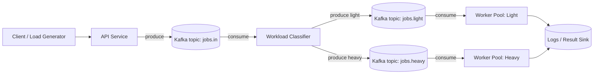
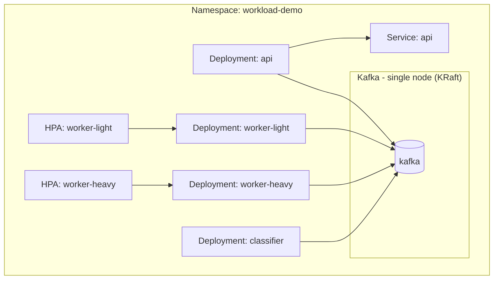

# Kubernetes Intelligent Workload Orchestrator  
### Kafka + Intelligent Routing + Independent Autoscaling

A production-inspired Kubernetes demo that shows how to run **bursty, compute-intensive workloads** alongside a **high-throughput API** using:

- Kafka for durable, decoupled ingestion
- Intelligent workload classification (light vs heavy)
- Independent worker pools with separate HPAs
- Resource governance (requests/limits)
- Observability hooks
- Isolation to prevent cross-workload instability

This is an **AI-adjacent infrastructure demo** focused on operationalization patterns — not model training.

---

# 🎯 Problem This Demonstrates

In distributed systems, mixed workloads often share infrastructure:

- High-volume request/response APIs
- Bursty, memory-intensive background jobs
- Unpredictable payload sizes
- CPU spikes during processing

If not isolated correctly:
- Heavy jobs degrade light workloads
- Autoscaling becomes unstable
- OOMKills increase
- API latency degrades

This demo shows how to prevent that using intelligent routing and Kubernetes-native scaling.

---

# 🏗 Architecture Overview

## Logical Flow



---

## Kubernetes Deployment View



---

# 🧠 Intelligent Classification

Baseline heuristic:

- `fileSizeMb >= 50`
- OR `pageCount >= 200`
- OR `imageCount >= 50`

→ route to **heavy**

Otherwise → **light**

This is intentionally simple and can be replaced with a real ML model without changing infrastructure.

---

# 🚀 Quickstart (3 Steps)

### 1️⃣ Deploy

```bash
bash scripts/demo.sh deploy
```

### 2️⃣ Generate Load

```bash
bash scripts/demo.sh load
```

### 3️⃣ Observe Scaling

```bash
bash scripts/demo.sh observe
```

---

# 📈 Results

## Intelligent Routing + Independent Scaling

### Baseline (Single Shared Worker Pool – Hypothetical)

- Heavy jobs increase CPU/memory pressure across all pods
- Light job latency increases during burst
- HPA scales entire pool aggressively
- Higher risk of OOMKills

### Intelligent Routing (This Demo)

- Heavy jobs route only to `worker-heavy`
- Light jobs remain isolated
- Heavy pool scales independently
- No cross-impact between workload classes

---

# 📸 Screenshot Checklist

### HPA Scaling

```bash
kubectl -n workload-demo get hpa
```

- ☐ Heavy workers scale during burst
- ☐ Light workers remain stable

### Pod Scaling

```bash
kubectl -n workload-demo get pods -w
```

- ☐ New heavy pods spin up
- ☐ No unexpected restarts

### Classifier Logs

```bash
kubectl -n workload-demo logs -f deploy/classifier
```

- ☐ Correct routing behavior

---

# 🛡 Production Hardening Roadmap

## Retry + DLQ

Add topics:
- `jobs.retry`
- `jobs.dlq`

Pattern:
- Fail → retry topic with attempt count
- Exceed max retries → DLQ
- Ensure idempotent processing

---

## Backoff Strategy

Options:
- Retry scheduler service
- Tiered retry topics (`retry.10s`, `retry.1m`, etc.)
- External delay queue

---

## Custom Metrics HPA

Scale on:
- Consumer group lag
- Queue depth
- Processing rate

---

## Prometheus Adapter

Expose Kafka lag as `custom.metrics.k8s.io` and configure HPA to scale based on lag per worker pool.

---

## Security + Governance

- SASL/SCRAM or mTLS for Kafka
- NetworkPolicies
- Secret management
- Signed images + policy enforcement

---

## Observability

- OpenTelemetry tracing with correlation IDs
- Centralized logging
- Dashboards for:
  - p95 processing time
  - Lag per topic
  - DLQ volume
  - HPA events

---

# 📦 Repository Structure

```
.
├── README.md
├── docs/
│   └── architecture.md
├── infra/k8s/
├── services/
├── scripts/
```

---

## License

MIT
