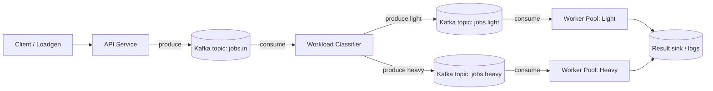
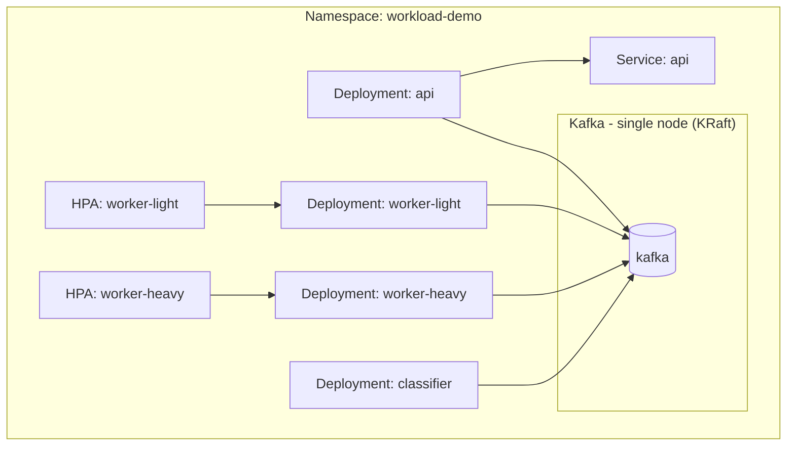

# Architecture

This demo implements a common production pattern: **separate a high-QPS API from bursty, compute-heavy async workloads**, and isolate heavy workloads into their own worker pool.

---

## Logical flow

---

## Kubernetes deployment view

---

## Classification logic

Default heuristic:
- If `fileSizeMb >= 50` OR `pageCount >= 200` OR `imageCount >= 50` → **heavy**
- else → **light**

Swap with a real model later if desired.

---

## Scaling strategy

- `worker-light`: smaller CPU/memory requests; HPA targets CPU utilization
- `worker-heavy`: higher memory requests/limits; HPA targets CPU utilization

Core idea: **independent scaling and isolation** so heavy jobs scale heavy workers without destabilizing light processing.
